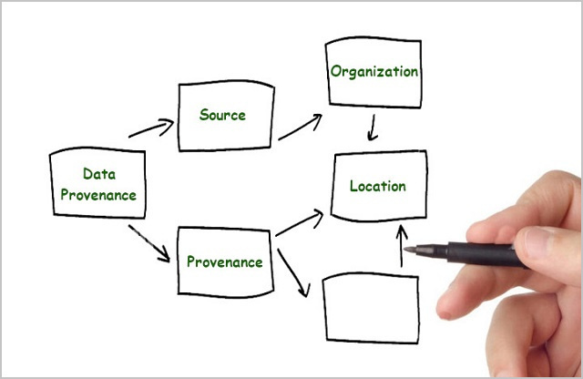

# Information Modeling for Data Interoperability

NIST describes an Information Model [[IM]](IM) as:

> An information model is a representation of concepts, relationships, constraints, rules,
> and operations to specify data semantics for a chosen domain of discourse.
> The advantage of using an information model is that it can provide sharable, stable, and
> organized structure of information requirements for the domain context.
> 
> An information modeling language is a formal syntax that allows users to capture data
> semantics and constraints.

This hints at the primary reasons for using an information model:

1. **High Level** - not only is an IM sharable, stable and structured, it is a high level
specification that separates information **requirements** from implementation details.
This makes an IM suitable for initial conceptual design where details are unknown or distracting,
down to implementation and deployment where unambiguous specification of details using a formal
syntax is essential for robustness and interoperability.
2. **Language Independent** - an information modeling language defines information in a way that
is representation-independent both within a process and when stored or communicated among processes.
Because an IM is requirements focused, a single specification applies to all data formats, and a single
information value (described below) ensures lossless conversion between literal values in any data format.



Consider an environment with two different processes and two different message formats
where an information model defines the semantics and constraints of an arbitrary data type "Foo":


* process 1 (a .NET application) writes a C# value X of type Foo to message A (XML format)
* process 2 (a Javascript application) reads message A and validates it as an instance of Foo
* process 2 writes that Javascript value to message B (JSON format)
* process 1 reads message B and validates it as a C# value Y of Type Foo

If value X = value Y, then we know that processes 1 and 2 have the same information, and
message A is equivalent to (carries the same information as) message B. The information model
defines how to translate a message from any format to another and back, without loss.
Describing how this is accomplished requires some common terminology:

1. **Class:** a blueprint or template for creating objects. It defines the characteristics
   (data or variables) and behaviors (functions or methods) that objects of that class will possess.
2. **Object:** an instance of a class.
3. **Datatype:** a classification that specifies the kind of value a variable can hold and how the
   computer interprets it. It dictates the operations that can be performed on the data and how much
   memory is allocated for it.
4. **Value:** an instance of a type within a process.
5. **Literal:** an instance of a type outside a process. A literal is an immutable sequence of bytes
or characters. Two different literals that are instances of the same information value are referred
to as equivalent.
6. **I/O:** input/output. In the IM context I/O defines the mapping between literals and values,
parsing input and serializing output in a specified data format.

Although class and datatype appear similar, the critical distinction is that objects are dynamic while values
are static. Classes are a programming language's mechanisms for implementing variables while types define
the set of distinct constant values a variable of a given type may have, as defined in [[XSD]](xsd):

> In this specification, a datatype has three properties:
> * **value space**, which is a set of values.
> * **lexical space**, which is a set of **literals** used to denote the values.
> * a small collection of functions, relations, and procedures associated with the datatype.
> Included are equality and (for some datatypes) order relations on the **value space**,
> and a **lexical mapping**, which is a mapping from the **lexical space** into the **value space**.

To illustrate the relationship between objects, values and literals, consider the **information** in
a geographic coordinate:

> Coordinate: A set of two numbers - a latitude with a value between -90.0 and 90.0 degrees and
> a longitude with a value between -180.0 and 180.0 degrees.

The semantics of coordinate is the same across all processing environments with no dependence on
programming language or coding techniques. A designer uses an information modeling language to
express coordinate semantics by defining a datatype, for example:
```
Coordinate = Record
    1 latitude     Latitude
    2 longitude    Longitude

Latitude = Number [-90.0, 90.0]
Longitude = Number (-180.0, 180.0]
```
where **Record** and **Number** are datatypes built into an IM language. Record is a collection of values
and Number is an atomic value, with semantics defined by the IM language and the designer's model.
The Coordinate data type specifies what values a variable of type Coordinate may have, but not how it
is implemented or what operations, such as computing the distance between two Coordinates, it supports.

A single **value** of type Coordinate (for example 38.8895, -77.0352) is processed using an **object**
containing two IEEE 754 floating point values somewhere, but details of the object aside from those two
values is irrelevant. The **lexical mapping** used for message I/O is the key to interoperability.
The single Coordinate value can be serialized, for example, using at least three different dialects of XML,
four dialects of JSON / YAML, raw binary, CBOR, and other data formats, as well as with literals
using degrees-minutes-seconds format instead of decimal degrees in all formats.
All of these messages carry the identical information value and are equivalent.
And as above, the motivation for information modeling is to enable message design based on information
requirements, not the merits of any particular message format.

```
XML:
   <Coordinate latitude="38.8895" longitude="-77.0352"></Coordinate>
    
   <Coordinate>
     <Latitude>38.8895</Latitude>
     <Longitude>-77.0352</Longitude>
   </Coordinate
    
   <Coordinate>38.8895, -77.0352</Coordinate>

JSON:
   {"latitude": 38.8895, "longitude": -77.0352}
   
   {1: 38.8895, 2: -77.0352}
    
   [38.8895, -77.0352]
    
   "38.8895, -77.0352"

YAML:
   ---
   latitude: 38.8895
   longitude: -77.0352
  
   ---
   1: 38.8895
   2: -77.0352  
     
   ---
   - 38.8895
   - -77.0352
       
   38.8895, -77.0352

Binary - 8 bytes, two IEEE 754 floats:
   421B8ED9 C29A1206

Concise Binary Object Encoding (CBOR) - 11 bytes, two floats:
   82                # array(2)
      FA 421B8ED9    # primitive(1109102297)
      FA C29A1206    # primitive(3264877062)
```

---------
**Parking lot:**

Javascript [[ES](#es)]
4.3.1 "Even though ECMAScript includes syntax for class definitions, ECMAScript objects are not
fundamentally class-based such as those in C++, Smalltalk, or Java."

4.4.17-19 Boolean value, type, object  
4.4.20-22 String value, type, object  
4.4.23-25 Number value, type, object
23.1 Array Objects  
23.2 TypedArray Objects  
24.1 Map Objects  
24.2 Set Objects  
24.3 WeakMap Objects
24.4 WeakSet Objects

Objects do not mean Object-Oriented Programming:
The DEC PDP-11 1970's-era minicomputer has memory, registers, operations, and I/O.
Even its 8- and 16-bit values operated on by machine-level instructions are objects with values and operations:


"YAML Schemas" [[YAMLS](#yamls)]
describes advantages of using the YAML data format and the challenges of validating YAML data
in various programming languages.

---------

## References

###### [IM]
*"Information Modeling: From Design to Implementation"*, Y. Tina Lee, NIST, September 1999,
https://tsapps.nist.gov/publication/get_pdf.cfm?pub_id=821265

###### [ES]
*"ECMAScript 2026 Language Specification"*, ECMA International, 15 July 2025, https://tc39.es/ecma262/#sec-set-objects

###### [XSD]
*"W3C XML Schema Definition Language (XSD) 1.1 Part 2: Datatypes"*, W3C, 5 April 2012,
https://www.w3.org/TR/xmlschema11-2/#datatype

###### [YAMLS]
*"YAML Schemas"*, Codethink, November 2021, https://www.codethink.co.uk/articles/2021/yaml-schemas/
