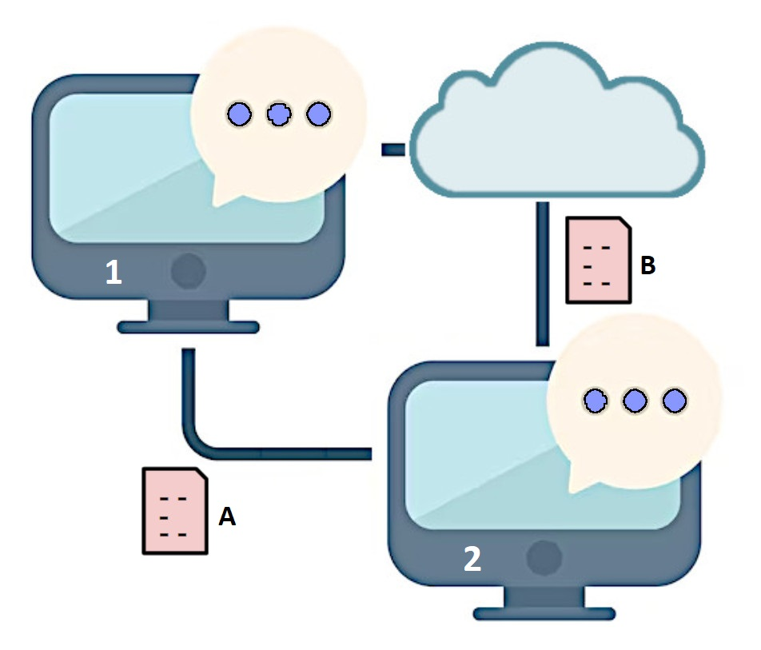
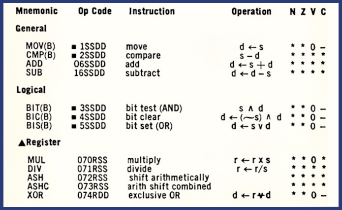

# Information Modeling for Data Interoperability

NIST describes an Information Model [[IM]](IM) as:

> An information model is a representation of concepts, relationships, constraints, rules,
> and operations to specify data semantics for a chosen domain of discourse.
> The advantage of using an information model is that it can provide sharable, stable, and
> organized structure of information requirements for the domain context.
> 
> An information modeling language is a formal syntax that allows users to capture data
> semantics and constraints.

That covers a broad range of activity, but a primary use of information models is to specify
the information content of data communicated between processes. An information modeling language
defines information in a way that is representation-independent both inside and outside a process.
Consider an example with two different processing environments and two different message formats
where an information model defines the semantics and constraints of an arbitrary data type "Foo":

* process 1 (a .NET application) writes a C# value X of type Foo to message A (XML format)
* process 2 (a Javascript application) reads message A and validates it as an instance of Foo
* process 2 writes that Javascript value to message B (JSON format)
* process 1 reads message B and validates it as a C# value Y of Type Foo

If value X = value Y, then we know that processes 1 and 2 have the same information, and
message A is equivalent to (carries the same information as) message B. The information model
defines how to translate a message from any format to another and back, without loss.
Describing how this is accomplished requires some common terminology:

1. **Class:** a blueprint or template for creating objects. It defines the characteristics
   (data or variables) and behaviors (functions or methods) that objects of that class will possess.
2. **Object:** an instance of a class.
3. **Datatype:** a classification that specifies the kind of value a variable can hold and how the
   computer interprets it. It dictates the operations that can be performed on the data and how much
   memory is allocated for it.
4. **Value:** an instance of a type within a process.
5. **Literal:** an instance of a type outside a process. A literal is an immutable sequence of bytes
or characters. Two literals that are instances of the same value are equivalent.
6. **I/O:** input/output. In the IM context I/O defines the mapping between literals and values.

Although class and type are similar, the critical distinction is that objects are dynamic while values
are static. Classes are a programming languages' mechanisms for implementing variables while types define
the set of values a variable may have. An IM does not address classes or objects; it specifies only datatypes.
Information modeling uses [[XSD]](xsd)'s definition verbatim:

> In this specification, a datatype has three properties:
> * **value space**, which is a set of values.
> * **lexical space**, which is a set of **literals** used to denote the values.
> * a small collection of functions, relations, and procedures associated with the datatype.
> Included are equality and (for some datatypes) order relations on the **value space**,
> and a **lexical mapping**, which is a mapping from the **lexical space** into the **value space**.

---------

<!---
> In the objected-oriented approach, the fundamental construct is the object, which incorporates both
> data structures and functions. The building blocks in the O-O model are object classes, attributes,
> operations, and associations (relationships.)

There is a critical distinction between the object-oriented **approach** and an object-oriented
**programming language**:
Every hardware CPU, virtual machine, and programming environment, simply by processing data,
has object classes, attributes, operations and associations:

* **Literals** are constant values (sequences of bytes or characters) suitable for storage and transmission.
* **Objects** hold variable values in a processing environment.
* Input translates literals into object values.
* Output translates object values to literals.
* An object has an information value with operations supported by a processing environment, but
loading, processing and saving information does not require an OOP language.

Example:
* The DEC PDP-11, a 1970's era minicomputer, has memory, registers, operations, and I/O.
Even its 8- and 16-bit values operated on by machine-level instructions are objects:

The semantic meaning of an information value is independent of any literal values used
to represent it.
--->

## References

###### [IM]
*"Information Modeling: From Design to Implementation"*, Y. Tina Lee, NIST, September 1999,
https://tsapps.nist.gov/publication/get_pdf.cfm?pub_id=821265

###### [XSD]
*"W3C XML Schema Definition Language (XSD) 1.1 Part 2: Datatypes"*, W3C, 5 April 2012,
https://www.w3.org/TR/xmlschema11-2/#datatype

###### [2]
"Mastering Classes and Objects", Dev Community,
https://dev.to/singhaayush/mastering-classes-and-objects-step-by-step-for-beginners-28i4